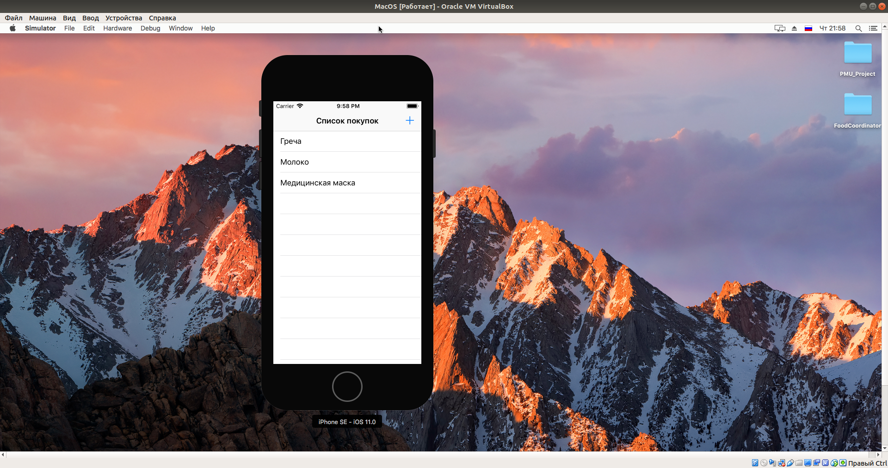
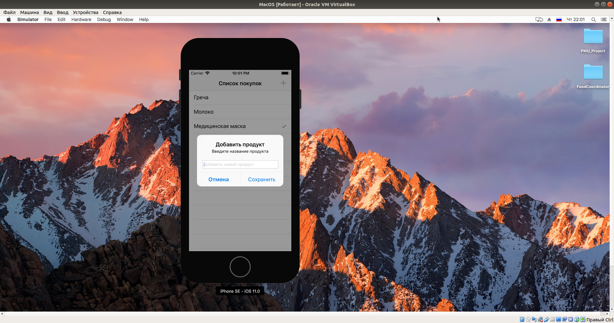

# Координатор покупок: лабораторная работа по ПМУ

## Реализация

Приложение реализовано с помощью архитектурного паттерна MVP. Соответствующие классы находятся по папкам: Model, View, Presenter. Все данные хранятся с помощью CoreData (см. Model).

## Скриншоты

Главный экран

При выборе продукта ставится/убирается галочка

При нажатии на крестик, появляется Alert, в который вводятся данные

После добавления он отображается в основном списке

При свайпе справа-налево по продукту его можно удалять

После удаления продукт больше не отображается

